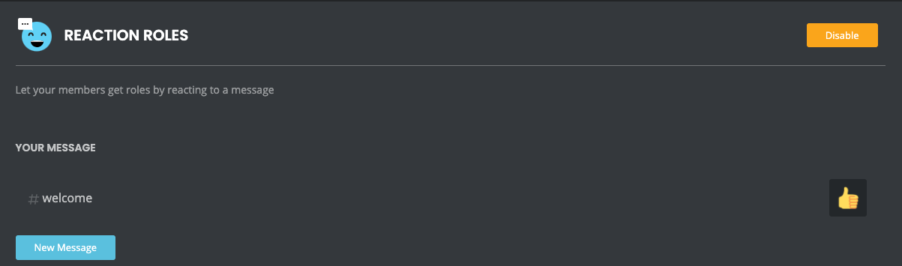
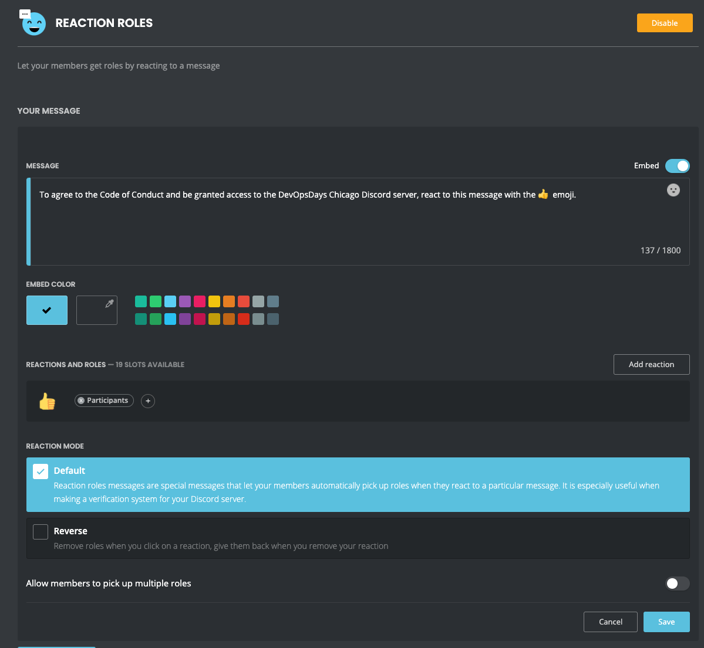
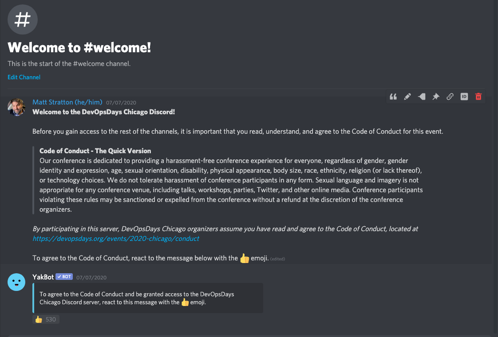

# Virtual Event - How We Did It

Sept 1, 2020 was the 7th annual [DevOpsDays Chicago](https://devopsdays.org/chicago) conference. It was also the first time we did it virtually. It was super well-received, and a lot of folks have been asking me for details on our implmentation.



## The Program
stuff about why did we do one day, how did we pick the schedule, things we learned about breaks/lunch with time zones, and we fell into the trap of stil thinking of physical vs virtual

however talk about how we knew we didn't have to do "talks in the morning, open spaces in the afternoon" due to laws of physics thing

One interesting thing that occured was due to us deviating from the "usual" DevOpsDays talk length (30 minutes), several speakers didn't notice that the length had changed! We had one speaker turn in a 25 minute recording; when I pointed this out to them, they said "oh, I thought I was being helpful by making it shorter", as they hadn't seen that the length was 20 minutes, not 30. This is a reminder to be extra explicit with details like this to your speakers!

## Participant Experience

we did stuff for blah blah blah, 

### Discord Setup

#### Registration and Invite Link
used eventbrite, and shared the invite link that way in a few ways. We also put all the registrant emails into Mailchimp and sent a participant email to them all.

#### Code of Conduct 
used the mee6 bot, explain how this worked, etc

One key element of any devopsdays event is the Code of Conduct. We needed to be sure that participants in the virtual experience had agreed to this. The method we used was to require attendees to "accept" the Code of Conduct when they joined our Discord, and they would not be granted access to post/view in any channels until they had done so.

The experience went something like this:

1. Attendee joins the Discord server
2. The only channel that they see is the `#welcome` channel, which is read-only, and contains the Code of Conduct
3. They are instructed to "react" to a message using the thumbs-up emojii in order to agree to the Code of Conduct
4. Once they have done this, they are automatically granted access to the rest of the Discord server

In order to accomplish this, we created a "role" on the Discord server called `Participants`. This role was granted access to all the main channels, with all the rights we wanted participants to have.

The `@everyone` role (built into Discord) was *not* given access to any channels except for the `#welcome` channel (we did, later, decide to give `@everyone` access to the read-only `#faq` channel, in case more details were needed for someone just joining). 

In order to set up this auto-role, we used a bot provided by [mee6](https://mee6.xyz/). The feature of mee6 you want to use is called "Reaction Roles". The setup looks like this:

This results in an experience in the `#welcome` channel that will look like this:

#### Channel setup for breakouts
how did people pick them? talk about the staging category, permissions, etc

### Moderator setup
push to talk, priority speaker, training, etc

### On-site vs virtual team
why did we do it this way blah blah blah

## Streaming of the talks
it was important for us that everyone could see the talks, even without registering, being on the platform, etc, so we did it all via youtube live. 

### Recording of the talks
why did we do pre-recorded, how did we do it (link to recording doc?)

fun benefit of the high quality recordings is that speakers now have a great recording of their talk!

theory of why not to do pre-recorded is more aspirational than in practice (riffing on other talks, etc). speakers are MORE likely to just "drop in" for their talk with virtual than physical, so optimizing for something that is unlikely to happen was not our choice.

### Fireside chats
discussion on why we did these, how did we do them (zoom, etc)
include screenshotof yak fireside here

### AV costs
give a swag, not details, on our budget/costs

## Sponsors
experimenting with what it meant to be a sponsor, etc

### Sponsorship levels and benefits

### Sponsor channel setup
Note that we considered doing a "role" in Discord for this, but didn't, but we probably would in the future. 

### Sponsor onboarding

## Speaker experience

### Speaker comms

### Virtual speaker dinner

## Overall promo stuff/misc

### Participant training
the video matt recorded

### Yak promo video

### Interstitial videos
"We'll be right yak"/ devops deep thoughts

blah blah fun stuff, deep thoguhts, yak, etc

