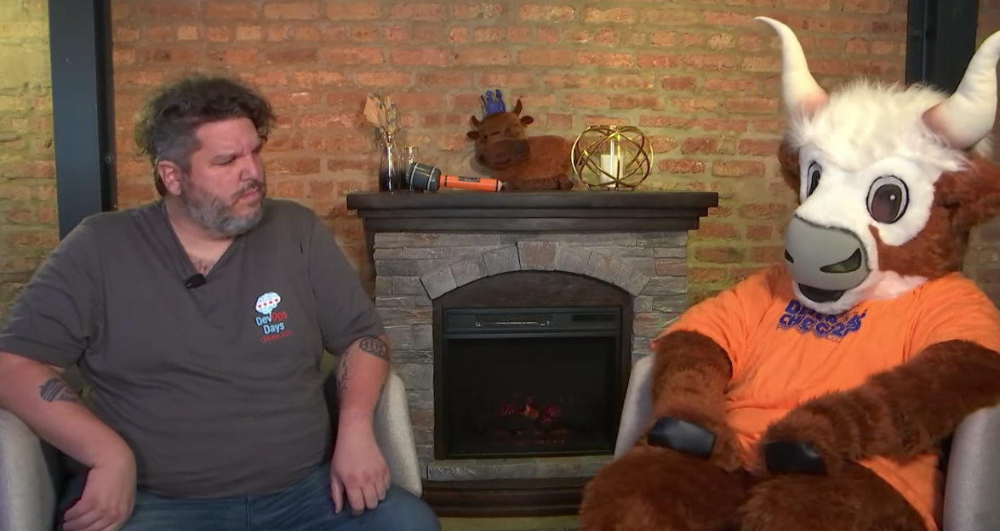

# Hosting a Participant-First Conference in the Age of Corona - How To Do It

Sept 1, 2020 was the 7th annual [DevOpsDays Chicago](https://devopsdays.org/chicago) conference. It was also the first time we did it virtually. It was super well-received, and a lot of folks have been asking me for details on our implmentation.



## The Program

The usual DevOpsDays Chicago conference is a two-day event, with a single track of talks in the morning, with Open Space discussions in the afternoon. For the virtual event, we decided to make it a single day event.

We chose to do a single day, as we were concerned with the time investment for participants in a two-day virtual event. We did consider making it two days, but half days, but thought that it would be more engaging and in the spirit of the participant-forward approach to have everyone focused on a single day.

When considering our program, we realized that a lot of things with our traditional schedule were bound by the "laws of physics" of having hundreds of people in a physical space, and having to move them around. For example, it's not pratical in the physical space to have a talk with everyone in one room, and then leave for 20 minutes of breakouts, and then move back to the main hall, etc. But in a virtual space, this is completely possible! We decided we could mix the "open spaces" in throughout the day interspersed with the actual talks.

That said, we still did fall into the trap of "thinking physical" by scheduling a single, longer, lunch break in the middle of the day in our event's time zone; given that participants were not restricted to US Central Time, we would likely have done better to have content all day, but schedule several breaks for participants to get their meals according to their own preferences.

One interesting thing that occured was due to us deviating from the "usual" DevOpsDays talk length (30 minutes), several speakers didn't notice that the length had changed! We had one speaker turn in a 25 minute recording; when I pointed this out to them, they said "oh, I thought I was being helpful by making it shorter", as they hadn't seen that the length was 20 minutes, not 30. This is a reminder to be extra explicit with details like this to your speakers!

## Participant Experience

The philosophy of the DevOpsDays Chicago event has always been a "participant-first" event. For example, we intentionally use the term "participiant" instead of "attendee" on badges for the in-person event, as a reminder that people aren't just "attending" or watching; they all help create the experience!

When we made the decision to hold the event virtually, it was essential to us to do our best to keep this spirit alive. We didn't want an event that was "a webinar with a Slack channel"; we wanted to heavily encourage participantion from everyone, including speakers, sponsors, and registrants. 

Another key element is we wanted the content (the talks) to be availble to anyone, with no registration gate. We decided to stream the content via YouTube Live, with a publicly available and promoted URL. To engage in the participant experience elements, we did require a free registration, primarily to provide an ability for participants to agree to the Code of Conduct, which is a key element for DevOpsDays.

We investigated several different online platforms for this, but none of them really provided the ability for breakouts in the spirit of attendee-led engagement (in the spirit of Open Spaces). There are plenty of platforms that provide breakouts, etc, but none that allowed for the type of "on demand" topics we were looking for. 

We finally decided to use the Discord platform for the interactive portions of the event. This allowed us to have video breakouts that were easy to set up, and we also really liked the granular approach (role-based) security and permissions that Discord provided us, as opposed to Slack, for example. 

### Discord Setup

#### Registration and Invite Link

Registration for the event was done via Eventbrite. A week prior to the event, all registrants received an email with the link to join the Discord server. We also enabled the Eventbrite confirmation emails that were sent for anyone who registered in the week prior to the event to include the Discord invite.

We also imported all of the registrant emails into Mailchimp, and we sent all of the communications to participants via Mailchimp. This gave us much more flexibility in the formatting, etc, of the emails, so it was easier for us to embed how-to videos and other helpful links. 

For the speakers, we gave them a special role in Discord that gave them permission to a private speakers-only channel. We used the [Invite-Role Bot](https://top.gg/bot/480240313525600267) to mange this. If we had to do it again, we would do this for sponsors too, to give them a special role.

#### Code of Conduct 

One key element of any devopsdays event is the Code of Conduct. We needed to be sure that participants in the virtual experience had agreed to this. The method we used was to require attendees to "accept" the Code of Conduct when they joined our Discord, and they would not be granted access to post/view in any channels until they had done so.

The experience went something like this:

1. Attendee joins the Discord server
2. The only channel that they see is the `#welcome` channel, which is read-only, and contains the Code of Conduct
3. They are instructed to "react" to a message using the thumbs-up emoji in order to agree to the Code of Conduct
4. Once they have done this, they are automatically granted access to the rest of the Discord server

In order to accomplish this, we created a "role" on the Discord server called `Participants`. This role was granted access to all the main channels, with all the rights we wanted participants to have.

The `@everyone` role (built into Discord) was *not* given access to any channels except for the `#welcome` channel (we did, later, decide to give `@everyone` access to the read-only `#faq` channel, in case more details were needed for someone just joining). 

In order to set up this auto-role, we used a bot provided by [mee6](https://mee6.xyz/). The feature of mee6 you want to use is called "Reaction Roles". The setup looks like this:

This results in an experience in the `#welcome` channel that will look like this:

#### Channel setup for breakouts

For the breakouts that happened throughout the day, we had a special channel in Discord where people could propose the topics they wanted to talk about. We had a channel category called "Breakouts" which included all the text and video channels for each topic that were currently active for that time slot. 

After a breakout time slot was over, the text channels for those topics were moved to a category in Discord called "Past Breakouts", where they were still active and the discussion could continue, but this helped folks figure out what the currently active topics were. 

Video breakout channels were deleted after their time slot was over. 

Since it was essential for every video breakout room to have a moderator, all breakout channels (text and video) were "staged" shortly before they went live in a category in Discord called "Breakout Staging". The permissions on this category only allowed moderators and organizers to see and join these channels, so a moderator could join the channel before it was made accessible to the rest of the event. 

When you move a channel from one category to another, it inherits the permissions of that category, so all we had to do to make a breakout "live" was drag it from "Breakout Staging" into "Breakouts".

### Moderator setup
Usually, the Open Spaces at our event are unmoderated; the community does a pretty good job with them in-person. But for the video breakouts, it was really important to us to have a moderator in each session - to check for Code of Conduct issues, but also to help facilitate the discussion. 

Given the virtual nature of the event, we were able to recruit volunteer moderators from a pool of people who wouldn't normally travel to attend our event. It was important to us that our moderators have experience in leading these types of discussion, and that we trusted them to understand the philosophies of DevOpsDays open spaces. 

All moderators were instructed to use Push to Talk in Discord, which gave us the ability to grant them "Priority Speaker" permission in Discord; this meant when they were talking in a video channel, they would override all other audio. Due to this, moderators were also recommended to not participate in the open space discussions that way, but simply be there to help facilitate. 

We required all moderators (and organizers!) to attened a brief training session; I offered several different options, to facilitate time zones. The deck I used for training (if you really want to see it) can be viewed [here](https://docs.google.com/presentation/d/1CnEWtUNWEQVj-YbZzDYJJsc-msYy0f-__2jdDGXUInY/edit?usp=sharing). 

### On-site vs virtual team
Our event was produced on-site at a local music venue, with the help of [AV Chicago](https://avchicago.com/). All talks were pre-recorded, but the hosts/MCs were streamed live, as well as the MC-hosted chats with the speakers (see "Fireside Chats" below). 

For safety and social distancing reasons, we limited the team members who were allowed to be on-site at the venue to the MCs and our AV team. All other organizing team members were on our "virtual team" and performed their duties (managing the Participant Experience, fielding questions from participants and sponsors, etc) remotely from their own homes.

This did create an intersting effect of having two separate teams who had two completely different experiences! I honestly have no idea what the actual virtual experience was like, as I was one of the MCs who was on-site doing introductions and chats, and I was not in the virtual event space at all. In fact, at one point, one of my teammembers took my phone away from me as I was getting a little *too* involved in the Discord :)

## Streaming of the talks
It was important for us that everyone could see the talks, even without registering, being on the platform, etc. As mentioned earlier, the conference stream was presented via YouTube Live. We created a virtual redirect on [https://live.devopsdayschi.org](https://live.devopsdayschi.org) to the stream, to make it easy to share and remember. We also disabled comments on the YouTube stream, to remove the need for moderation.  

Every speaker also had a dedicated text channel in Discord; this allowed for real-time discussion of the talk amongst participants, and speakers were encouraged to participate in this chat during their talk.

### Recording of the talks
One of the big questions with a virtual event is "are the talks live, or pre-recorded?"

People have strong feelings on this topic. We ultimately decided to have all of our talks pre-recorded, for a few reasons:

Advantages of "live" talks:

- Less prep work needed from speakers and organizers
- Content can be "up to the minute" fresh
- Speakers can "riff" off of previous talks and reference content from earlier in the program

Advantages of pre-recorded

- Minimize potential challenges during the live event (issues with speaker connectivity, scheduling, etc)
- Production quality can be much higher (more on this later)
- Predictability for schedule (no chance of a talk going "long" or "short" since you already know how long the recording is)
- Speakers can interact with viewers during their talk in the real-time chat

My personal observation is that the main argument given for "live" talks (speakers referring to earlier content) is much more aspirational than truly done in practice, especially with virtual events. In a single-track in-person event, it's highly likely that a speaker will have seen the previous talks of the day, simply due to the fact that they were more likely to be sitting in the room! Yes, with in-person events you still can have a speaker who only shows up for their talk, and their talk alone, but this is even more common in virtual events, in my experience. I definitely have observed with the majority of virtual events that I have participated in, that the "riffing off other talks" is much more "work as imagined" vs "work as done". 

(Note: you *can* have an event where the speakers will make their talks interactive to each other, but this requires a fair amount of intentionality on the part of the speakers and the organizers, and it won't just "magically" happen. Deserted Island DevOps was a great example of this actually happening, but it happened mostly due to the way things were structured - the speakers were actually "in game" with each other during other talks.) 

Getting professional recordings of our speakers was of course a challenge - compounded by the need for COVID related safety. For all of our speakers, the preference was to have them recorded by a video production professional. For speakers local to Chicago, we booked studio time with AV Chicago (our video production partner), and for speakers outside of the Chicago area, we found local recording studios/professionals and arranged recording time for each speaker.

For speakers who were unable to go into a studio (for health or other reasons), we created a [comprehensive self-recording guide](https://docs.google.com/document/d/1gGN-Pc7zz5xais_zP7xJfcJ-TGPdsvN00UiBhC5rBnE/edit?usp=sharing). The guide included tips on lighting, camera placement, and all of the things we requested to help make the quality of the recording as high as possible.

### Fireside chats
For each of our "main" talks (as in, not the shorter Ignite talks) we held a short "fireside chat" live session with the speaker and two of the hosts immediately afterwards. This happened at the same time as the breakout sessions.

For these chats, the speakers connected via Zoom, and the hosts sat in chairs where they could see the screen of the speaker (along with a camera so the speaker could see the hosts). These were streamed to the main stream. The hosts asked questions that either had been posed in the text chat during the speaker's talk, or just asked questions that occured to them as well. 

We had a screen set up that the hosts could see, where someone on the AV team could type in questions coming in from the chat in real time, so that the hosts could use those questions as they were being asked.

For fun, we had our [yak mascot join one of the hosts for the last fireside chat of the day](https://matty.wtf/yak-wtf). This reflects something that helped the event be even more fun and personal - keeping the personality of the event running throughout. 

### AV costs
Our largest cost for the event was the AV - while it was a high number, this included the costs for professional recording of each speaker, plus having AV Chicago produce the event for us (including being on-site for the day of the event, including multiple cameras and setups for the hosts and fireside chats). Overall, the event still ended up costing us about 30% of what our in-person event usually costs (food and venue costs are always the highest, and you don't have those when you go virtually). Our event was free, but we were able to cover the AV costs with sponsor revenue.

## Sponsors
With the move to virtual, things change with regard to sponsorships. We had the luxury of not being completely dependent upon sponsorship revenue for this event, so we were able to "experiment" a little bit with what it meant to sponsor DevOpsDays Chicago (that is to say, we could take the risk of offering different types of sponsorship, and if we didn't get many, we would still be able to do the event). Our hope was to be able to help sponsors and other events learn and adapt to this new way.

### Sponsorship levels and benefits

Our sponsorship offerings were inspired by our traditional levels, but with some changes (due to the fact that we didn't have physical sponsor booths). You can see what levels we offered on our [sponsor page](https://devopsdays.org/events/2020-chicago/sponsor) or check out the [entire prospectus](https://assets.devopsdays.org/events/2020/chicago/2020-chicago-devopsdays-prospectus.pdf) for more details.

Interesting things to note:

- Gold sponsors were provided a text and a video channel in Discord for their use to interact with participants. Silver sponsors had a text channel, but no video channel.
- Gold and Silver sponsors had the ability to have their company logo added as a custom emojii inside Discord
- Gold sponsors could provide a 3 minute "pitch" video that would play during sponsor break times (this was to replace the "1 minute pitch on the stage" that our Gold sponsors usually get).

### Sponsor channel setup
We considered doing a "role" in Discord for sponsors, but didn't, as we thought it would complicate the onboarding of sponsors. We probably would do this the future, however. 

### Sponsor onboarding

we created a [sponsor info page](https://devopsdays.org/events/2020-chicago/sponsor-info) on our website, which we shared with all sponsors, which contained all the relevent information and onboarding details. We also recorded a [video guide to Discord](https://youtu.be/rOZM4h_oYgA) to give a "howto" on the Discord process, and how to use the video channels, especially.

In retrospect, it would have been good to provide more "non-technical" onboarding to sponsors; in addition to "this is how to use the platform", it woudl be good to help give sponsors suggestions and ideas on how to interact with participants more effectively in the virtual space - "we have a booth, come see us!" doesn't work in the virtual world. 

As an example, we had very polarized feedback from our sponsors; some said they had next to zero engagement, and others said they had a lot of great engagement! This was 100% dependant on how the sponsor chose to interact with participants. Having a guide around this would make the experience much better for all sponsors.

## Overall promo stuff/misc
We did a few things to help promote the event and make the experience better and smoother for participants - and also to make it more fun! This included some onboarding/training materials to help particpants find their way in the new format, but we also really spent a lot of time and effort on making the whole thing feel very much like "DevOpsDays Chicago". For example, the "DevOps Yak" is a big part of our event's branding and feel, so we included the yak in all sorts of ways!

### Participant training
I recorded a [short "howto" video on using Discord](https://www.youtube.com/watch?v=OJoHn6ikUx0) for our event, including how to sign up for Discord, how to accept our Code of Conduct, and how to use the video features for breakouts. We also created a [similar video that we sent to sponsors](https://youtu.be/rOZM4h_oYgA).

The "training" video was emailed to all registrants about a week before the event (which was the time we opened up our Discord for people to join in advance) and was also linked to in the Eventbrite registration confirmation emails from that point on. We also played this video on the live stream right before the first breakout session.

### Yak promo video

We created a short, fun video that was a spoof of a scene from *Love, Actually*, using our Yak mascot, to try to help drive excitement for the event. We posted the video on Twitter and LinkedIn, and it was at least pretty fun to make! Things like this help make your event feel more personal than just a stream of talks.



