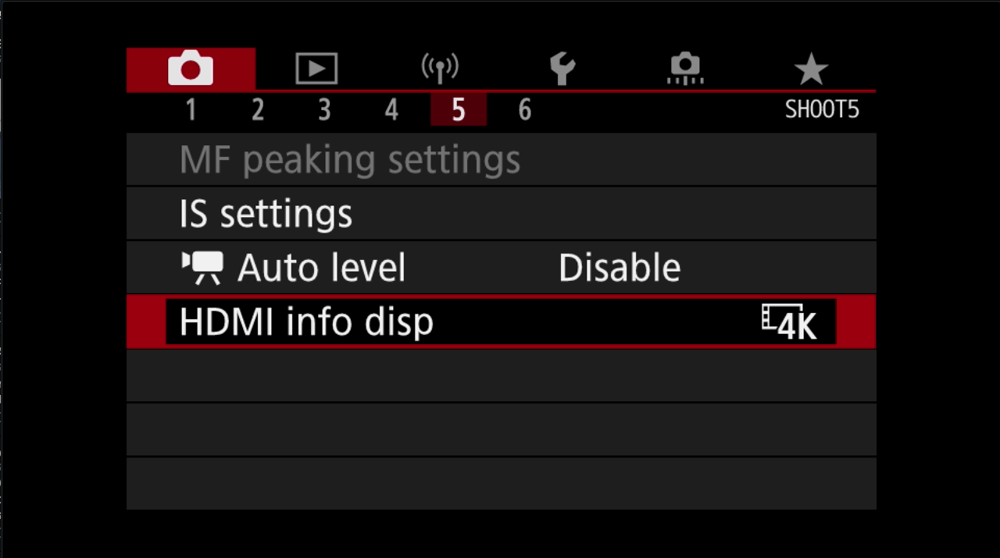
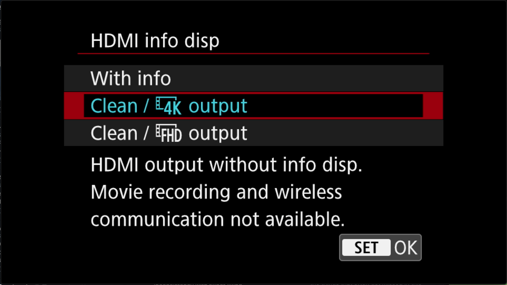
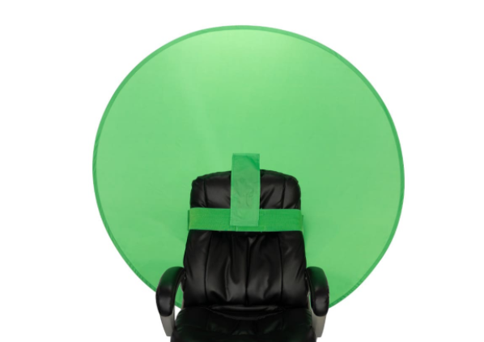

# My AV setup for working/streaming at home

(title needs some work)

Given the change to complete remote work, especially for virtual conference presenting, etc, I decided to get myself really set up the way I liked it. This post just exists to go into detail on how I have things set up, for two reasons:

1. Share the setup in case anyone has something similar, and wants to know how I did certain things
2. Have a place to keep track of all my setup.

## Hardware

In this section, I'll illustrate the various bits of physical hardware that make up my setup, as well as any idiosyncracies I've discovered with them.

### Cameras

I use cameras for two main purposes - one is for the "everyday" meetings (Zoom calls, Google Meet, BlueJeans, etc), and the other is for presentations (virtual conferences, recordings, internal presentations). These both have slightly different requirements, although it's feasible to have one camera setup that accomplishes both. I didn't go that route because I'm extra, apparently.

#### Canon M6 Mark II

This is the camera I prefer to use for recording/presenting, when looking the best matters! This is a mirrorless camera, which is sorta like a dSLR, except that it isn't. For purposes of my use, the main advantage of this camera is that it has interchangeable lenses, and I can futz around with the aperture settings, getting that oh-so-desired "out of focus background" effect.

##### Accessories and Lenses

As mentioned, the real advantage for this type of camera is having different lenses. I currently have two:

- [Sigma 16mm f/1.4 DC DN Contemporary Lens for Canon EF-M](https://www.amazon.com/gp/product/B081QPDKM9)
- [Canon EF-M 32mm f/1.4 STM Lens](https://www.amazon.com/dp/B07H4F65YR)

The advantage of these lenses is they are very "fast" - this means that they can have a very large aperature, which is what you need to get that [bokeh](https://en.wikipedia.org/wiki/Bokeh) effect. The disadvantage is they are both "prime" lenses - which means they do not have any telephoto (aka, they cannot zoom in and out). So you are stuck with the single focal length. 

I initially started with the 16mm Sigma lens; I found that with the setup of my desk, this had too short of a focal length (it's not a wide angle lens, but too much of my room was ending up in the shot). Also, this lens is HEAVY, and the mounting arm I use for my camera couldn't quite handle the weight without me resting the lens on the top of my monitor.

So I switched to the 32mm Canon lens; the problem is that now it's too *long* of a focal lenth, so if I have the lens at the edge of my monitor, it's a closeup of, like, one of my eyes (okay, not really, but still).

I currently am using the 32mm lens, but have the camera mounted as far back as possible (limited by the fact that there is, well, a wall behind my desk). It's an acceptable distance at this point, but I do wish I could get it a couple inches further back to have perfection.

Speaking of mounting...I use the [Elgato Multi Mount](https://www.corsair.com/us/en/Categories/Products/Elgato-Gaming/Multi-Mount/p/10AAB9901) and [Elgato Multi Mount Flex Arm Kit](https://www.corsair.com/us/en/Categories/Products/Elgato-Gaming/Multi-Mount-Flex-Arm-Kit/p/10AAC9901) to mount my camera (actually, right now I'm not using the flex-arm kit, because of the aforementioned issue with location of the camera).

Another key thing you want if you are rocking a dSLR or a mirrorless camera is a "dummy" battery adapter. This keeps you from having to keep swapping in and out batteries. The good news is, these work generally pretty well. The bad news is, they are super hard to track down (at least the [one I needed](https://shop.usa.canon.com/shop/en/catalog/ac-adapter-kit-ack-e17) was). It took several attempts to get one, and I ended up having to buy it from an eBay seller in the UK. 

##### Settings

One thing you need to do with your camera is set it to export "clean" HDMI so that you can dump that into your computer. What does this mean? Well, usually, the HDMI output from a camera simply reflects what is on the back LCD display; so it's got all the fun meters and icons and stuff. This does not look good on your recordings.

It took me longer than it should have to figure out how to set this on the Canon M6 Mark II. First thing, you have to be in "movie mode" on the main dial.

Then, you want to set it via these controls:

Notice how it says "wireless communication not available"? This is one of the most annoying things with the Canon; when you are outputting "clean" HDMI, the WiFi and Bluetooth capabilities are disabled. Why does this matter? Because when your camera is mounted up above your desk, it would be SUPER USEFUL to be able to use the app on your phone to adjust settings, or even, I don't know...SET THE FOCUS. Sigh.

##### Capture Device

The Canon won't go directly into your computer via USB; the USB connection is just for transferring files or updating firmware (when that works, which seems to be "not always"). So I use the [Elgato Cam Link 4K](https://www.elgato.com/en/gaming/cam-link-4k) - this takes in the HDMI output of the camera, and plugs into the computer via USB. It's a handy little device, with only two downsides:

1. It's pricey, and hard to find during global pandemics
2. It makes my MacBook's fans spin up like they are blowing leaves around a suburban front yard

#### Logitech Brio

For my day-to-day video conferencing needs, I just stick with the tried-and-true USB webcam route (I don't use the built-in camera on my laptop because when I'm at my desk I run my laptop closed, with only a single, albeit ridiculously large, monitor). 

I currently am using the [Logitetch Brio webcam](https://www.amazon.com/Logitech-BRIO-Conferencing-Recording-Streaming/dp/B01N5UOYC4). It's pretty darn good quality, and I frankly like that it has the ability to go pretty wide as an option, but that's just for when we are doing family videoconferences and games and I want all my kids to be able to be in the shot without having to sit on each other's laps.

Not much to say, except that it's pretty necessary to use the [Camera Settings application](https://prosupport.logi.com/hc/en-us/articles/360039591834-Downloads-BRIO) for the Brio in order to make it useful. And sadly there isn't a [cask](https://dev.to/mattstratton/my-brewfile-1pob) for this app, which annoys me.

The (not free) [Webcam Settings app](https://apps.apple.com/us/app/webcam-settings/id533696630?mt=12) in the Mac App Store is another helpful tool for this camera.

### Lighting

### Microphone/Audio

### Computer

### Monitor/Display

### Green Screen

I use a fun green screen that mounts to the back of my chair - ["The Big Shot" by Webaround](https://thewebaround.com/product/the-big-shot/). 

blah blah blah lighting stuff

## Software

list of all the various software, etc. make sections about subject areas, and then go into configuration details as needed

If you want to be a big nerd, I install all my software via [Homebrew](https://brew.sh/), and I keep an updated [Brewfile](https://github.com/mattstratton/matty-dotfiles/blob/master/Brewfile) with the stuff I use. 

### OBS

Note that for OBS I needed to add a 300ms audio delay for recording, etc, becasue of the lag from the Focusrite vs the camera (sync issue).

## TODO

this is where I'll put stuff I am still working through.

## List of all gear with links

Just to make it easier, here's a list of everything mentioned in this post.

- [Canon M6 Mark II mirrorless camera](https://www.amazon.com/gp/product/B07ZJSB146)
- [Sigma 16mm f/1.4 DC DN Contemporary Lens for Canon EF-M](https://www.amazon.com/gp/product/B081QPDKM9)
- [Canon EF-M 32mm f/1.4 STM Lens](https://www.amazon.com/dp/B07H4F65YR)
- [Canon AC Adapter Kit ACK-E17](https://shop.usa.canon.com/shop/en/catalog/ac-adapter-kit-ack-e17)
- [Elgato Cam Link 4K](https://www.elgato.com/en/gaming/cam-link-4k)
- [Logitetch Brio webcam](https://www.amazon.com/Logitech-BRIO-Conferencing-Recording-Streaming/dp/B01N5UOYC4)
- [Webaround Green Screen](https://thewebaround.com/product/the-big-shot/)
- [Elgato Stream Deck XL](https://www.amazon.com/Elgato-Stream-Deck-XL-customizable/dp/B07RL8H55Z)
- [Elgato Key Light](https://www.amazon.com/Elgato-Key-Light-Professional-App-Enabled/dp/B07L755X9G/)
- [Elgato Multi Mount](https://www.corsair.com/us/en/Categories/Products/Elgato-Gaming/Multi-Mount/p/10AAB9901) and [Elgato Multi Mount Flex Arm Kit](https://www.corsair.com/us/en/Categories/Products/Elgato-Gaming/Multi-Mount-Flex-Arm-Kit/p/10AAC9901)
- [Electro-Voice RE320 microphone](https://www.amazon.com/Electro-Voice-RE320-Diaphragm-Dynamic-Microphone/dp/B00KCN83VI)
- [Focusrite Scarlett Solo USB Audio Interface](https://www.amazon.com/Focusrite-Scarlett-Audio-Interface-Tools/dp/B07QR6Z1JB)
- [RODE PSA 1 Swivel Mount Studio Microphone Boom Arm](https://www.amazon.com/gp/product/B001D7UYBO/)
- [Rain Design mTower Vertical Laptop Stand](https://www.amazon.com/gp/product/B077YLS9QP)
- [Dell UltraSharp 49" Curved Monitor (U4919DW)](https://www.dell.com/en-us/work/shop/dell-ultrasharp-49-curved-monitor-u4919dw/apd/210-arnw/monitors-monitor-accessories)
- [CalDigit TS3 Plus Thunderbolt 3 Dock](https://www.amazon.com/CalDigit-TS3-Plus-Thunderbolt-Dock/dp/B07CZPV8DF)
